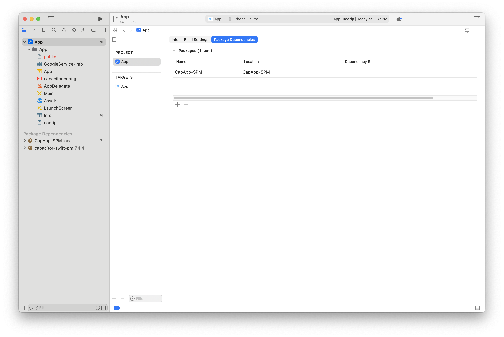
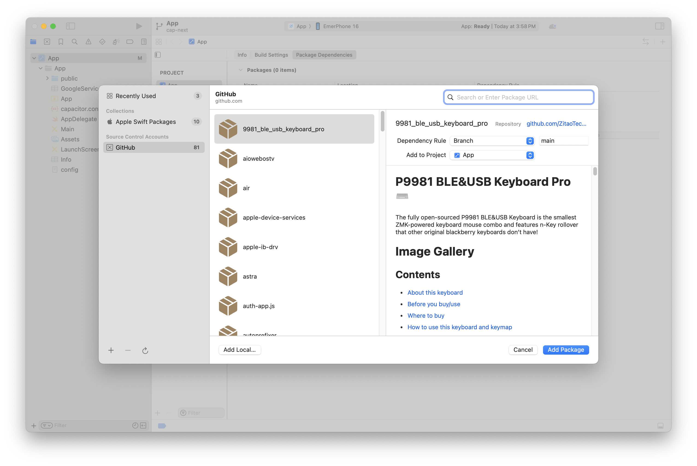
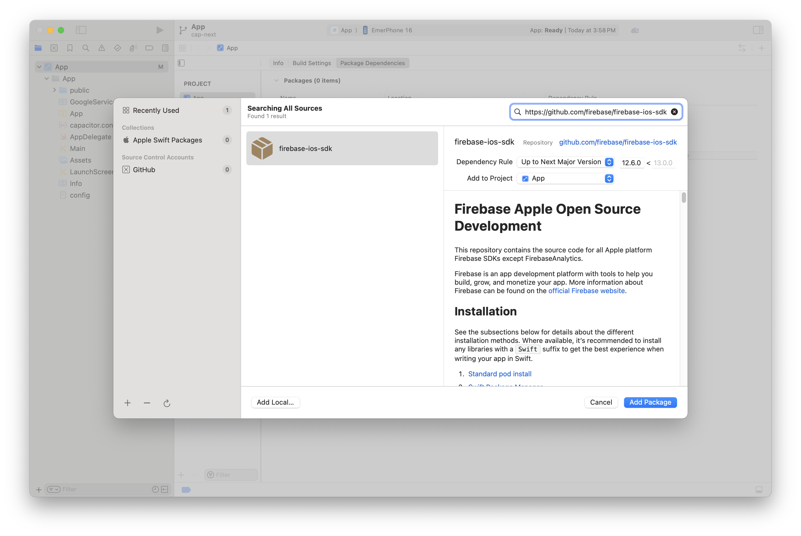
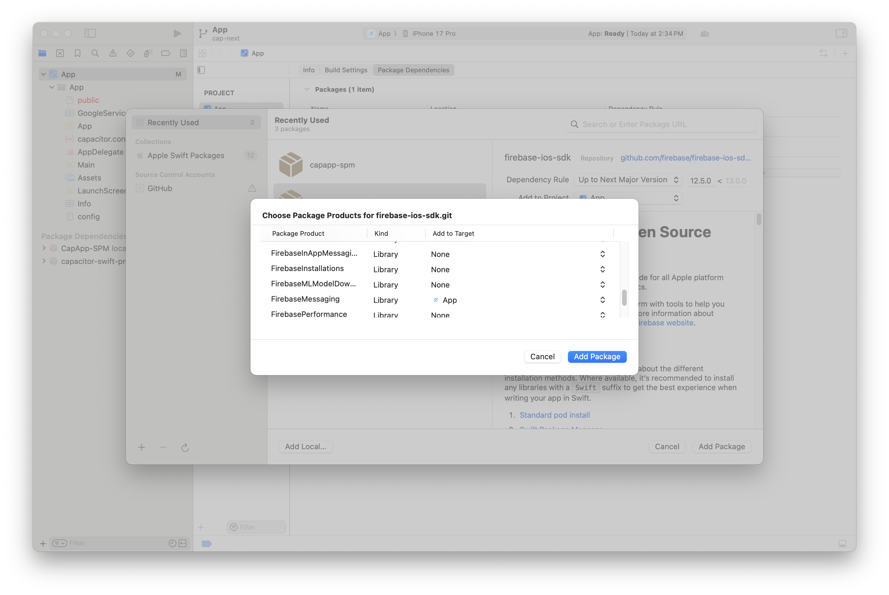
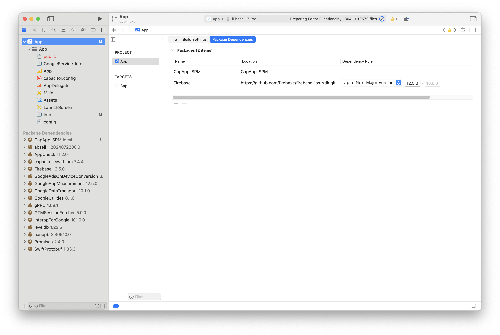

# 在 Ionic + Angular 应用中结合 Firebase 使用推送通知

**Web 框架**: Angular
**平台**: iOS, Android

应用程序开发人员为其用户提供的最常见功能之一就是推送通知。在本教程中，我们将逐步介绍在 iOS 和 Android 上让 [Firebase Cloud Messaging](https://firebase.google.com/docs/cloud-messaging) 正常工作所需的所有步骤。

为了注册和监听来自 Firebase 的推送通知，我们将在 Ionic + Angular 应用中使用 [Capacitor 的推送通知 API](https://capacitorjs.com/docs/apis/push-notifications)。

## 所需依赖

使用 Capacitor 构建和部署 iOS 及 Android 应用需要进行一些环境设置。请在继续之前[按照说明安装必要的 Capacitor 依赖](/main/getting-started/environment-setup.md)。

要在 iOS 上测试推送通知，Apple 要求你拥有[一个付费的 Apple 开发者账号](https://developer.apple.com/)。

此外，我们使用 Firebase 来推送通知，因此如果你使用其他也使用 Firebase SDK 的 Cordova 插件，请确保它们是最新版本。

## 准备一个 Ionic Capacitor 应用

如果你已有现有的 Ionic 应用，请跳过此部分。如果没有，让我们先创建一个 Ionic 应用。

在你偏好的终端中，安装最新版本的 Ionic CLI：

```bash
npm install -g @ionic/cli
```

接下来，我们使用 CLI 基于 **blank** 启动模板创建一个新的 Ionic Angular 应用，并将其命名为 **capApp**：

```bash
ionic start capApp blank --type=angular
```

应用创建成功后，切换到新创建的项目目录：

```bash
cd capApp/
```

最后，编辑 `capacitor.config.ts` 中的 `appId`。

```diff
const config: CapacitorConfig = {
- appId: 'io.ionic.starter',
+ appId: 'com.mydomain.myappnam',
  appName: 'capApp',
  webDir: 'www'
};
```

## 构建应用 & 添加平台

在向此项目添加任何原生平台之前，必须至少构建应用一次。Web 构建会创建 Capacitor 所需的 Web 资源目录（在 Ionic Angular 项目中为 `www` 文件夹）。

```bash
ionic build
```

接下来，让我们向应用添加 iOS 和 Android 平台。

```bash
ionic cap add ios
ionic cap add android
```

运行这些命令后，将在项目根目录下创建 `android` 和 `ios` 文件夹。这些是完全独立的原生项目产物，应被视为你的 Ionic 应用的一部分（即，将其纳入版本控制）。

## 使用 Capacitor 推送通知 API

首先，我们需要安装 Capacitor 推送通知插件：

```bash
npm install @capacitor/push-notifications
npx cap sync
```

然后，在开始使用 Firebase 之前，我们需要确保应用能够通过 Capacitor 推送通知 API 注册推送通知。我们还将添加一个 `alert`（你也可以使用 `console.log` 语句）来在通知到达且应用在前台打开时显示其负载。

在你的应用中，进入 `home.page.ts` 文件，添加 `import` 语句和一个 `const` 以使用 Capacitor 推送 API：

```typescript
import {
  ActionPerformed,
  PushNotificationSchema,
  PushNotifications,
  Token,
} from '@capacitor/push-notifications';
```

然后，添加 `ngOnInit()` 方法，其中包含一些用于注册和监听推送通知的 API 方法。我们还将添加一些 `alert()` 到部分事件中以监控运行情况：

```typescript
export class HomePage implements OnInit {
  ngOnInit() {
    console.log('Initializing HomePage');

    // 请求使用推送通知的权限
    // iOS 将提示用户并返回是否授予权限
    // Android 将直接授予权限而不提示
    PushNotifications.requestPermissions().then(result => {
      if (result.receive === 'granted') {
        // 通过 APNS/FCM 向 Apple/Google 注册以接收推送
        PushNotifications.register();
      } else {
        // 显示一些错误信息
      }
    });

    // 成功后，我们应该能够接收通知
    PushNotifications.addListener('registration',
      (token: Token) => {
        alert('推送注册成功，令牌：' + token.value);
      }
    );

    // 我们的设置存在问题，推送将无法工作
    PushNotifications.addListener('registrationError',
      (error: any) => {
        alert('注册时出错：' + JSON.stringify(error));
      }
    );

    // 如果应用在前台打开，显示通知负载
    PushNotifications.addListener('pushNotificationReceived',
      (notification: PushNotificationSchema) => {
        alert('收到推送：' + JSON.stringify(notification));
      }
    );

    // 点击通知时调用的方法
    PushNotifications.addListener('pushNotificationActionPerformed',
      (notification: ActionPerformed) => {
        alert('推送操作已执行：' + JSON.stringify(notification));
      }
    );
  }
}
```

以下是 `home.page.ts` 的完整实现：

```typescript
import { Component, OnInit } from '@angular/core';

import {
  ActionPerformed,
  PushNotificationSchema,
  PushNotifications,
  Token,
} from '@capacitor/push-notifications';

@Component({
  selector: 'app-home',
  templateUrl: 'home.page.html',
  styleUrls: ['home.page.scss'],
})
export class HomePage implements OnInit {
  ngOnInit() {
    console.log('Initializing HomePage');

    // 请求使用推送通知的权限
    // iOS 将提示用户并返回是否授予权限
    // Android 将直接授予权限而不提示
    PushNotifications.requestPermissions().then(result => {
      if (result.receive === 'granted') {
        // 通过 APNS/FCM 向 Apple/Google 注册以接收推送
        PushNotifications.register();
      } else {
        // 显示一些错误信息
      }
    });

    PushNotifications.addListener('registration', (token: Token) => {
      alert('推送注册成功，令牌：' + token.value);
    });

    PushNotifications.addListener('registrationError', (error: any) => {
      alert('注册时出错：' + JSON.stringify(error));
    });

    PushNotifications.addListener(
      'pushNotificationReceived',
      (notification: PushNotificationSchema) => {
        alert('收到推送：' + JSON.stringify(notification));
      },
    );

    PushNotifications.addListener(
      'pushNotificationActionPerformed',
      (notification: ActionPerformed) => {
        alert('推送操作已执行：' + JSON.stringify(notification));
      },
    );
  }
}
```

之后，你需要生成新的构建并让 Capacitor 知道这些变更。可以使用以下命令完成：

```bash
ionic build
npx cap copy
```

## 在 Firebase 上为你的应用创建项目

在将 Firebase Cloud Messaging 连接到你的应用程序并发送推送通知之前，你需要在 Firebase 中创建一个项目。

前往 [Firebase 控制台](https://console.firebase.google.com/)，点击 **添加项目** 按钮。

为项目命名，接受 Firebase 服务条款，然后点击 **创建项目** 继续。项目 ID 将自动为你生成。

## Android

### 将 Firebase 集成到 Android 应用

本节大致对应 [使用 Firebase 控制台设置 Firebase 的文档](https://firebase.google.com/docs/android/setup?authuser=0)。请参见下文了解 Capacitor 相关的具体说明。

前往 Firebase 项目的项目概览页面，在顶部点击 **Android** 图标以添加一个新的 Android 应用程序。


下一个屏幕会要求你提供一些应用信息。

- 你的 **Android 包名** 应与 `capacitor.config.ts` 中的 **appId** 匹配
- 我们在此 Capacitor 应用 ID 中使用了 `com.mydomain.myappname`，因此我们将使用它作为此项的值。
- 昵称和调试签名证书是可选的

然后点击 **注册应用** 按钮。

### 下载并使用 `google-services.json` 文件

接下来会提示你下载 `google-services.json` 文件。该文件包含你的 Capacitor 应用从 Android 连接到 Firebase 所需的信息。

将 `google-services.json` 文件下载到本地机器。然后将该文件移动到你的 Capacitor Android 项目目录中，具体路径为 `android/app/`。


我们不需要向项目_添加_任何依赖，因为 `@capacitor/push-notifications` 在其 `build.gradle` 文件中自动包含了 `firebase-messaging` 的某一版本。

## iOS

### 前置条件

iOS 推送通知的设置比 Android 复杂得多。你必须有[一个付费的 Apple 开发者账号](https://developer.apple.com/)_并且_在能够使用 iOS 应用测试推送通知之前，需要处理好以下事项：

1. 在 Apple 开发者门户中为你的 iOS 应用[设置合适的开发或生产证书及配置文件](https://help.apple.com/xcode/mac/current/#/dev60b6fbbc7)
2. 在 Apple 开发者门户中[创建一个 APNS 证书或密钥](https://developer.apple.com/documentation/usernotifications/setting_up_a_remote_notification_server/establishing_a_certificate-based_connection_to_apns)，用于开发或生产环境
3. 在 Xcode 中[确保已在你的应用中启用推送通知功能](https://help.apple.com/xcode/mac/current/#/dev88ff319e7)

### 将 Firebase 集成到原生 iOS 应用

这部分与上述 Android 部分非常相似，但有一些关键区别。

首先，前往 Firebase 项目的**项目概览**页面。如果你一直在按照本指南操作，页面顶部应该已经列出了一个 Android 应用程序。

要向 Firebase 项目添加 iOS，请点击**添加应用**按钮并选择 **iOS** 平台。

下一个屏幕会要求你提供一些应用信息。

- 你的 **iOS Bundle ID** 应与 `capacitor.config.ts` 中的 **appId** 匹配
- 我们在此 Capacitor 应用 ID 中使用了 `com.mydomain.myappname`，因此我们将使用它作为此项的值。
- 应用昵称和 App Store ID 是可选的

然后点击 **注册应用** 按钮。

### 将 `GoogleService-Info.plist` 文件添加到 iOS 应用

_注意：这与用于 Android 应用的文件**不同**。_

将提供的 `GoogleService-Info.plist` 下载到本地机器。

然后你**必须**打开 Xcode...

```bash
npx cap open ios
```

... 并按照 Firebase 的指示将 `.plist` 文件移入 Xcode 项目，确保添加到所有 target。


### 添加 Firebase SDK

iOS 上的推送通知 API 使用 Swift Package Manager 或 CocoaPods 进行依赖管理。我们需要告知它们使用 Firebase。

#### 使用 Swift Package Manager (SPM)

要使用 SPM 添加 SDK，你需要对 `ios/App/App.xcodeproj` 进行修改。

首先，通过运行 `npx cap open ios` 或在 Finder 中双击该文件，在 Xcode 中打开 `ios/App/App.xcodeproj`。

在左侧选择你的 App，然后在右侧选择 Package Dependencies，如下所示。



然后，点击加号图标添加新包，将显示类似以下内容。



在搜索框中输入 `https://github.com/firebase/firebase-ios-sdk`，然后选择"Add Package"。



现在滚动并将 Firebase Messaging 添加到 App target。



点击"Add Package"，等待处理完成。完成后你应该看到类似下图的内容。



#### 使用 CocoaPods

为此，我们需要修改 `Podfile`，可以在 Xcode 的 `Pods` 下找到：


我们需要将 Firebase 添加到为 App target 提供的 CocoaPods 中。为此，在 `target 'App'` 部分添加 `pod FirebaseMessaging`，如下所示：

```ruby
target 'App' do
  capacitor_pods
  # 在此处添加你的 Pods
  pod 'FirebaseMessaging' # 添加此行
end
```

你的 `Podfile` 应该看起来像这样：

```ruby
require_relative '../../node_modules/@capacitor/ios/scripts/pods_helpers'

platform :ios, '14.0'
use_frameworks!

# 解决安装新 Cordova 插件后需要
# Product -> Clean Build Folder 来避免 Xcode 缓存 Pods 的问题
# 需要 CocoaPods 1.6 或更新版本
install! 'cocoapods', :disable_input_output_paths => true

def capacitor_pods
  pod 'Capacitor', :path => '../../node_modules/@capacitor/ios'
  pod 'CapacitorCordova', :path => '../../node_modules/@capacitor/ios'
  pod 'CapacitorApp', :path => '../../node_modules/@capacitor/app'
  pod 'CapacitorHaptics', :path => '../../node_modules/@capacitor/haptics'
  pod 'CapacitorKeyboard', :path => '../../node_modules/@capacitor/keyboard'
  pod 'CapacitorPushNotifications', :path => '../../node_modules/@capacitor/push-notifications'
  pod 'CapacitorStatusBar', :path => '../../node_modules/@capacitor/status-bar'
end

target 'App' do
  capacitor_pods
  # 在此处添加你的 Pods
  pod 'FirebaseMessaging'
end

post_install do |installer|
  assertDeploymentTarget(installer)
end
```

### 更新项目

现在我们需要确保 iOS 项目已安装正确的 Firebase CocoaPod。

_注意：这部分可能需要一些时间，因为 CocoaPods 需要下载所有适当的文件/依赖。_

```bash
npx cap update ios
```

### 添加初始化代码

要在 iOS 应用启动时连接到 Firebase，你需要在 `AppDelegate.swift` 文件中添加以下内容。

首先，在文件顶部添加 `import`：

```swift
import FirebaseCore
import FirebaseMessaging
```

... 然后在 `AppDelegate.swift` 文件的 `application(didFinishLaunchingWithOptions)` 方法中添加 Firebase 的配置方法到初始化代码中。

```swift
FirebaseApp.configure()
```

然后你需要添加以下两个方法以正确处理推送注册事件：

```swift
func application(_ application: UIApplication, didRegisterForRemoteNotificationsWithDeviceToken deviceToken: Data) {
  Messaging.messaging().apnsToken = deviceToken
  Messaging.messaging().token(completion: { (token, error) in
    if let error = error {
        NotificationCenter.default.post(name: .capacitorDidFailToRegisterForRemoteNotifications, object: error)
    } else if let token = token {
        NotificationCenter.default.post(name: .capacitorDidRegisterForRemoteNotifications, object: token)
    }
  })
}

func application(_ application: UIApplication, didFailToRegisterForRemoteNotificationsWithError error: Error) {
  NotificationCenter.default.post(name: .capacitorDidFailToRegisterForRemoteNotifications, object: error)
}
```

你的完整 `AppDelegate.swift` 文件应该看起来像这样：

```swift
import UIKit
import Capacitor
import FirebaseCore
import FirebaseMessaging

@UIApplicationMain
class AppDelegate: UIResponder, UIApplicationDelegate {

  var window: UIWindow?


  func application(_ application: UIApplication, didFinishLaunchingWithOptions launchOptions: [UIApplication.LaunchOptionsKey: Any]?) -> Bool {
    // 应用启动后的自定义覆盖点。
    FirebaseApp.configure()
    return true
  }

  func application(_ application: UIApplication, didRegisterForRemoteNotificationsWithDeviceToken deviceToken: Data) {
    Messaging.messaging().apnsToken = deviceToken
    Messaging.messaging().token(completion: { (token, error) in
      if let error = error {
          NotificationCenter.default.post(name: .capacitorDidFailToRegisterForRemoteNotifications, object: error)
      } else if let token = token {
          NotificationCenter.default.post(name: .capacitorDidRegisterForRemoteNotifications, object: token)
      }
    })
  }

  func application(_ application: UIApplication, didFailToRegisterForRemoteNotificationsWithError error: Error) {
    NotificationCenter.default.post(name: .capacitorDidFailToRegisterForRemoteNotifications, object: error)
  }
```

### 将 APNS 证书或密钥上传到 Firebase

如果你从一开始就按照说明进行操作，你已在 Apple 开发者门户中创建了 Apple APNS 证书或 APNS 认证密钥。你需要将其中之一上传到 Firebase，然后 Firebase 才能与 APNS 通信并向你的应用程序发送推送通知。

要上传你的证书或认证密钥，在**项目概览**页面：

1. 点击你的 iOS 应用程序，然后点击**设置**齿轮图标。
2. 在设置页面，点击**云消息传递**（Cloud Messaging）选项卡。
3. 在 **iOS 应用配置**标题下，使用提供的**上传**按钮上传你的认证密钥或证书。

## 发送测试通知

现在是令人兴奋的部分 - 让我们验证 Firebase 的推送通知在 Android 和 iOS 上是否正常工作！

我们需要在 Android 或 iOS 上启动我们的应用，以便 `home.page.ts` 页面能够注册并接收通知。

要在 Android Studio 中打开你的 Android 项目：

```bash
npx cap open android
```

要在 Xcode 中打开你的 iOS 项目：

```bash
npx cap open ios
```

项目打开后，使用 Android Studio 或 Xcode 的运行功能将应用侧载到设备上。应用应在首页启动。

_注意：在 iOS 上，你会看到一个弹出窗口，要求允许应用的通知 - 请确保选择**允许通知**！_

如果你的应用成功注册并且你遵循了上述代码，你应该会看到一个带有成功消息的提示框！

现在我们来测试设备是否能接收到通知。要发送通知，在 Firebase 中，转到项目窗格中 Grow 标题下的 **Cloud Messaging** 部分。

接下来，选择 **新建通知** 按钮。

创建通知时，你只需要指定以下信息：

1. 通知的文本内容
2. 标题（仅 Android 需要，iOS 可选）
3. 目标（用户分组或主题；我建议直接定位 iOS 或 Android 应用本身，见下图）


4. 调度（保留为"立即"）

此时，你可以**审核**已组合好的通知，然后选择**发布**以发送通知。

如果你的应用设置正确，你将在主屏幕上看到一个弹出提示，显示你在 Firebase 中编写的推送通知。然后你可以点击通知，根据我们上面的代码，你应该会收到一个 `pushActionPerformed` 事件的 `alert`。


## 推送通知中的图片

你可以按照以下指南选择性地在推送通知中包含图片。

:::tip
Firebase Messaging SDK 可以在其负载中包含 `ImageUrl` 属性并进行显示。URL 必须是 `https://` 格式，且大小不超过 300kb。
:::

### Android 中的图片
使用 `@capacitor/push-notifications` 时，Android 会自动显示图片。如果你在 [Firebase 控制台](https://console.firebase.google.com/) 中通过设置`通知图片`来测试，推送通知将在 Android 设备上显示，类似于以下截图：


### iOS 中的图片
iOS 需要在项目中添加一个[通知服务扩展](https://developer.apple.com/documentation/usernotifications/unnotificationserviceextension)才能在推送通知中显示图片。

在 Xcode 中：
- 点击 `File` > `New` > `Target`
- 选择 `Notification Service Extension` 并点击 `Next`
- 输入`产品名称`（例如 `pushextension`）
- 选择你的 Team
- 点击 `Finish`
- 当被询问时，点击 `Activate`

从 Target 列表中选择 `pushextension`，然后：
- 点击 `Signing & Capabilities`
- 点击 `+ Capability`
- 选择 `Push Notifications`
- 将 Deployment target 从 `iOS 16.4`（或 Xcode 选择的任何版本）更改为 `iOS 15.0`

:::note
如果你不更改扩展的 deployment target，图片将无法在旧版 iOS 的设备上显示。
:::

为扩展添加 Firebase Messaging：

使用 SPM：
- 选择 `pushextension` Target
- 在 `General` 下的 `Frameworks and Libraries` 中，点击"添加项目"按钮
- 添加 `FirebaseMessaging`

使用 CocoaPods：
打开你的 `Podfile` 并添加：
```ruby
target 'pushextension' do
  pod 'FirebaseMessaging'
end
```

然后通过运行以下命令更新 CocoaPods：
```bash
npx cap update ios
```

现在打开 `NotificationService.swift`（它将在名为 `pushextension` 的文件夹中），并将内容替换为以下代码：

```swift
import UserNotifications
import FirebaseMessaging

class NotificationService: UNNotificationServiceExtension {
    var contentHandler: ((UNNotificationContent) -> Void)?
    var bestAttemptContent: UNMutableNotificationContent?

    override func didReceive(_ request: UNNotificationRequest, withContentHandler contentHandler: @escaping (UNNotificationContent) -> Void) {
        guard let content = request.content.mutableCopy() as? UNMutableNotificationContent else { return }
        self.contentHandler = contentHandler
        self.bestAttemptContent = content
        
        FIRMessagingExtensionHelper().populateNotificationContent(content, withContentHandler: contentHandler)
    }
    
    override func serviceExtensionTimeWillExpire() {
        guard let contentHandler = contentHandler,
              let bestAttemptContent =  bestAttemptContent else { return }
        
        contentHandler(bestAttemptContent)
    }
}
```

你现在应该从 [Firebase 控制台](https://console.firebase.google.com/) 测试推送通知，记得设置`通知图片`并选择你的 iOS 应用。当通知到达 iOS 设备时，它将显示在右侧，如下所示：


