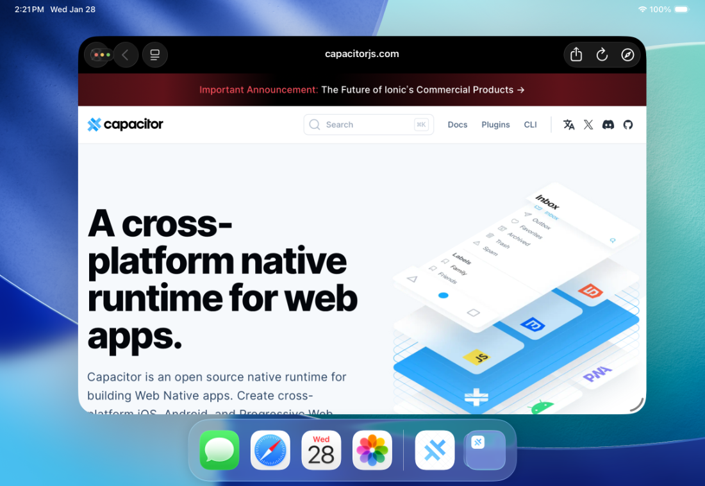
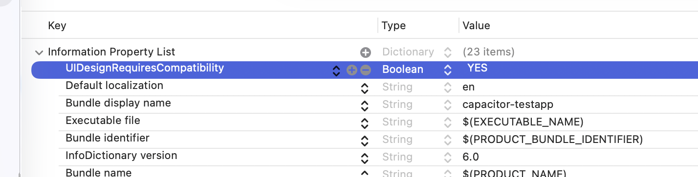
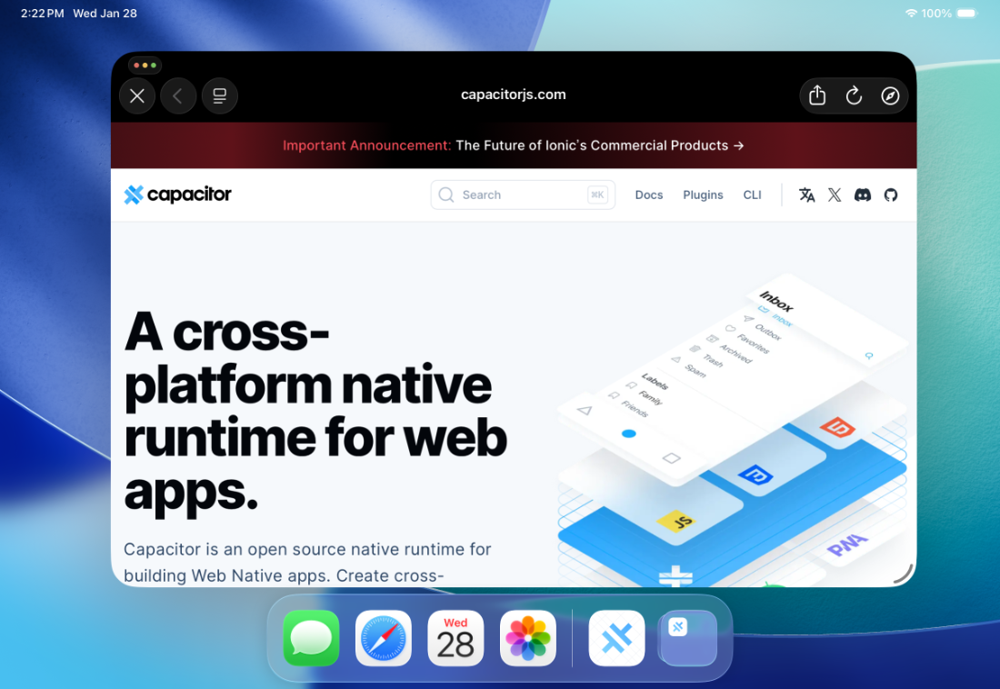

# iOS 配置

## 配置 `Info.plist`

`Info.plist` 文件是 iOS 应用程序的主要配置文件。当 Capacitor 插件需要新的设置或权限时，您可能需要编辑它。

要修改此文件，请[在 Xcode 中打开您的项目](/main/ios/index.md#opening-the-ios-project)，选择 **App** 项目和 **App** 目标，然后点击 **Info** 标签页。


> 您可以通过在表格中右键单击并在上下文菜单中勾选 **Raw Keys & Values** 来显示真实的键名。
>
> 您也可以手动打开并编辑 `ios/App/App/Info.plist` 文件来查看原始键值。请使用 [此参考文档](https://developer.apple.com/library/archive/documentation/General/Reference/InfoPlistKeyReference/Introduction/Introduction.html) 查看所有可能的键。

## 管理权限

iOS 权限不需要像 Android 那样明确指定。但是，iOS 要求在 `Info.plist` 中定义“使用说明”。这些设置是面向最终用户的可读描述，当请求访问特定设备 API 的权限时，会向用户显示这些描述。

请查阅 [Cocoa Keys](https://developer.apple.com/library/content/documentation/General/Reference/InfoPlistKeyReference/Articles/CocoaKeys.html) 列表，查找包含 `UsageDescription` 的键，以了解您的应用可能需要配置的各种使用说明。

有关更多信息，Apple 提供了 [解决隐私敏感数据应用被拒指南](https://developer.apple.com/library/content/qa/qa1937/_index.html)，其中包含更多关于需要提供使用说明的 API 的信息。

## 设置功能

“功能”用于启用您的应用可能需要的关键特性。当 Capacitor 插件需要时，您可能需要配置它们。

与其他配置选项和使用说明不同，“功能” _不_ 在 `Info.plist` 中配置。

要添加新功能，请[在 Xcode 中打开您的应用](/main/ios/index.md#opening-the-ios-project)，选择 **App** 项目和 **App** 目标，在标签栏中点击 **Signing & Capabilities**，然后点击 **+ Capability** 按钮。有关 iOS 功能的更多信息，请参阅 [这篇文章](https://developer.apple.com/documentation/xcode/adding_capabilities_to_your_app)。


## 重命名您的应用

您不能重命名 `App` 目录，但可以通过重命名 **App** 目标来设置应用的名称。

要重命名 **App** 目标，请[在 Xcode 中打开您的项目](/main/ios/index.md#opening-the-ios-project)，选择 **App** 项目，然后双击 **App** 目标。


接着，打开 `ios/App/Podfile` 文件，重命名文件底部的当前目标：

```diff
-target 'App' do
+target 'MyRenamedApp' do
   capacitor_pods
   # 在此处添加您的 Pods
 end
```

最后，在 [Capacitor 配置文件](/main/reference/config.md#schema) 的 `ios` 对象内添加 `scheme` 属性。

## 深度链接（即通用链接）

关于深度链接的指南，请[参见此处](/main/guides/deep-links.md)。

## iPadOS 26
从 iPadOS 26 开始，Apple 添加了新的窗口控件，使体验更接近桌面。这些控件可能与您的应用界面重叠：


要解决此问题，请在您的 `Info.plist` 中添加以下条目：
`UIDesignRequiresCompatibility = YES`：



这应该可以防止控件重叠：


这是一个临时解决方案，直到我们在未来版本的 Capacitor 中添加对窗口控件的进一步配置。